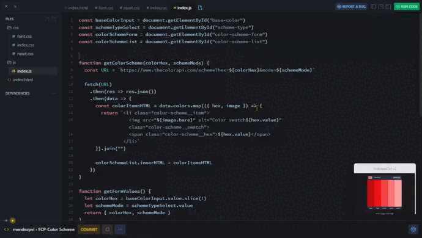

# Color Scheme - Solo Project

## *Overview* 🌟

This project is part of the "Working with APIs" module from [**Scrimba**](https://v2.scrimba.com/home)'s [**Frontend Career Path**](https://v2.scrimba.com/the-frontend-developer-career-path-c0j) course. The generator allows users to select a base color and a color scheme to display a color palette based on their selection, using data from The Color API.

## *Requeriments* 📝

✅ ~~Choose "seed color" with an `<input type="color">`~~

✅ ~~Choose color scheme mode in a `<select>` box.~~

✅ ~~Clicking button makes request to The Color API to get a color scheme~~

✅ ~~Display the scheme colors and hex values on the page~~

❌ ***Stretch goal:*** click hex values to copy to clipboard

## *Screenshot* 📷

## *Links* 🔗

[Scrim code](https://v2.scrimba.com/s01tqrt3d9) 👈

[Live site](https://mendezpvi.github.io/fcp-color-scheme/) 👈

[Scrimba projects repository](https://github.com/mendezpvi/fcp-scrimba) 👈

## *What I learned* 🤓

In this REST API section of the course, I learned how to work with HTTP requests to interact with external services, including:

🔳 HTTP Requests
+ URLs, endpoints.
+ Methods
+ Body
+ Headers

🔳 REST APIs
+ Resources
+ Parameters
+ Queries

## *Resources* 🗃️

🗃️ [Frontend Career Path](https://v2.scrimba.com/the-frontend-developer-career-path-c0j) by Scrimba

🗃️ [The Color API](https://www.thecolorapi.com/)

## *Author* 🔰

✨ X (formerly Twitter) - [@medezpvi](https://x.com/mendezpvi)